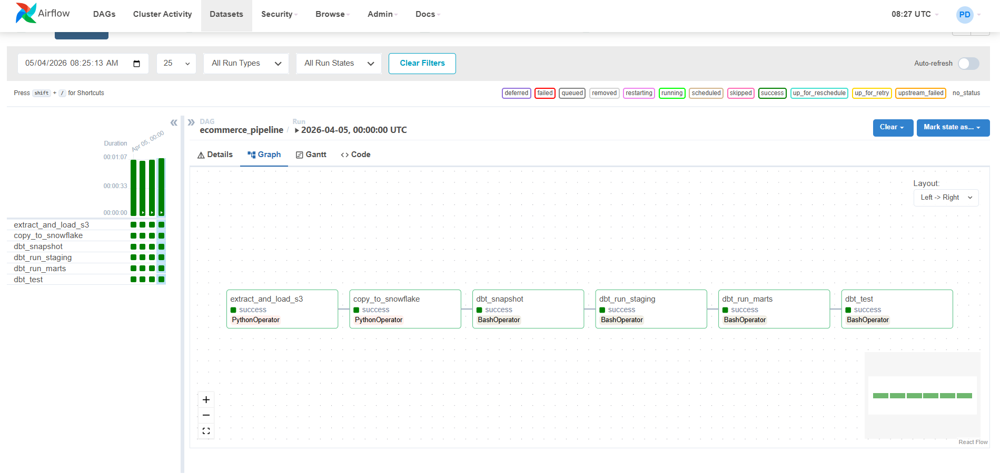
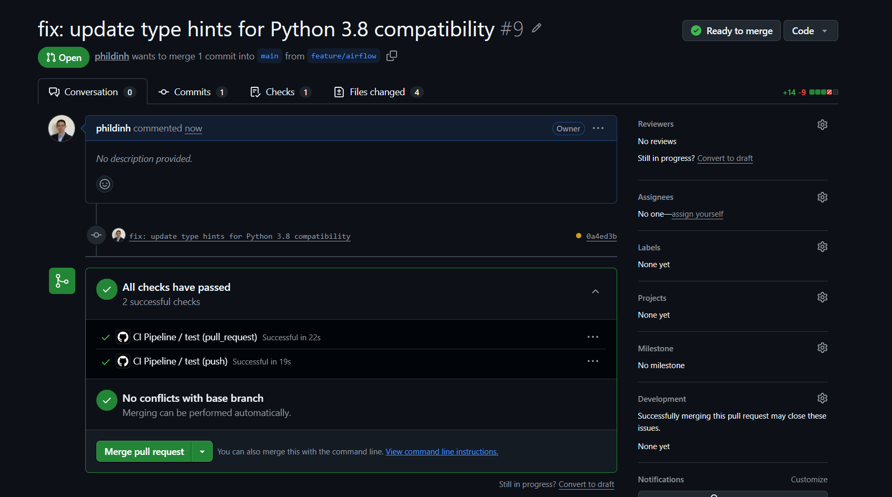
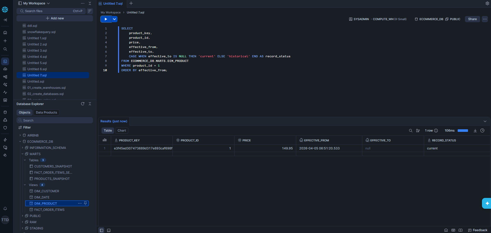
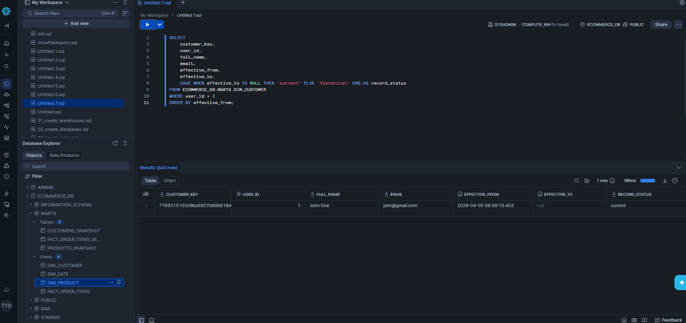
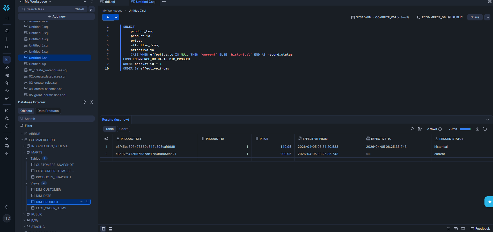
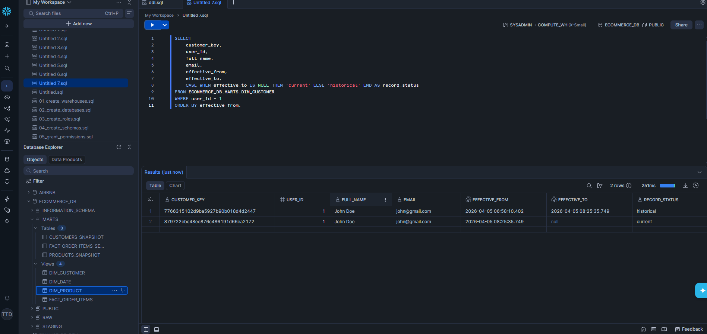

# Retail FMCG Data Pipeline

**Production-grade ELT pipeline built end-to-end — from REST API to star schema analytics, fully orchestrated, tested, and validated.**


---

## Pipeline in Action

**Airflow — All 6 tasks green on first successful run**


**GitHub Actions CI — All checks passing on every push**


---

## SCD Type 2 — Validated End to End

SCD Type 2 tracks historical changes to dimension records. When a product price or customer detail changes, the pipeline preserves the old version with a closing timestamp and inserts a new current record — so analysts can always join to the data that was true at the time of each order.

**Before — single current record**



**After — historical record preserved, new current record created**



Each version gets a unique surrogate key. The old record has `effective_to` filled in. The new record has `effective_to = null` — that's how the pipeline knows it's current.

---

## What This Project Does

This pipeline simulates a production FMCG retail data engineering workload. It extracts transactional data from a REST API, lands it in AWS S3 as Hive-partitioned JSON, loads it into Snowflake using `COPY INTO`, transforms it through a dbt medallion architecture, and serves a star schema to Power BI — all running automatically via Airflow in Docker.

The pipeline combines real API cart data with 50,000 rows of synthetic seed data to simulate realistic FMCG order volumes. A `data_source` column distinguishes the two throughout — `'real'` or `'synthetic'` — so analysts always know what they're looking at.

When the original FakeStoreAPI went permanently offline mid-project, the extraction layer was decoupled from the external dependency and replaced with a local mock that maintains the exact same interface. The rest of the pipeline — S3, Snowflake, dbt, Airflow — required zero changes. That's the value of clean separation of concerns.

---

## Architecture

```
Mock Data (FakeStoreExtractor)
    → Python (enrichment + S3 write)
    → AWS S3 (Hive-partitioned JSON · Bronze)
    → Snowflake RAW (COPY INTO specific file per run)
    → dbt STAGING (cleaned, typed, deduped · Silver)
    → dbt Snapshots (SCD Type 2 — customers + products)
    → dbt MARTS (star schema views · Gold)
    → Power BI (native Snowflake connector)
```

| Layer | Location | Strategy | Materialisation |
|---|---|---|---|
| **Bronze** | S3 + Snowflake RAW | Incremental append — never truncate | Raw tables |
| **Silver** | Snowflake STAGING | Rebuilt on each dbt run | Table |
| **Gold** | Snowflake MARTS | Always fresh, zero storage cost | View |

---

## Airflow DAG — 6 Tasks · @daily

```
extract_and_load_s3   →   copy_to_snowflake   →   dbt_snapshot
    (PythonOperator)          (PythonOperator)       (BashOperator)
                                   ↑
                           XCom: s3_keys + run_id

        →   dbt_run_staging   →   dbt_run_marts   →   dbt_test
              (BashOperator)       (BashOperator)    (BashOperator)
```

Tasks 1 and 2 use `PythonOperator` because runtime values (`s3_keys`, `run_id`) need to be passed between them via XCom. Tasks 3–6 use `BashOperator` to run dbt CLI commands. If any task fails, Airflow stops the chain — you rerun from the failure point, not from the beginning.

---

## Star Schema

**Fact table:** `fact_order_items` — grain: one row per product per order

| Table | Type | Notes |
|---|---|---|
| `fact_order_items` | Fact | Surrogate key via `dbt_utils.generate_surrogate_key` |
| `dim_customer` | SCD Type 2 | Current records: `dbt_valid_to IS NULL` · surrogate key includes `dbt_valid_from` |
| `dim_product` | SCD Type 2 | Tracks price and rating changes · surrogate key includes `dbt_valid_from` |
| `dim_date` | Date spine | 730 days from 2024-01-01 · `date_key` as YYYYMMDD |
| `fact_order_items_seed` | Seed | 50,000 synthetic rows UNION ALL'd into the mart |

`fact_order_items` joins to the dimension version that was active at the time of the order using date-range logic:

```sql
left join products p
    on  c.product_id = p.product_id
    and c.cart_date >= p.effective_from
    and (p.effective_to is null or c.cart_date < p.effective_to)
```

---

## Project Phases

| Phase | Description | Status |
|---|---|---|
| 1 | Environment setup — Python, Snowflake, AWS, dbt | ✅ |
| 2 | Ingestion layer — extract, S3 load, COPY INTO Snowflake | ✅ |
| 3 | pytest suite — 15 tests across extract and load modules | ✅ |
| 4 | dbt models — staging, SCD Type 2 snapshots, star schema marts | ✅ |
| 5 | Airflow + Docker — 6-task DAG, XCom, containerised orchestration | ✅ |
| 6 | CI/CD + README — GitHub Actions pytest on every push | ✅ |

---

## Repository Structure

```
ecommerce-pipeline/
├── ingestion/                       # Python ELT package
│   ├── pipeline.py                  # Main entry point — run_pipeline()
│   ├── mock_data.py                 # Local mock — products, users, carts
│   ├── api/
│   │   ├── api_client.py            # HTTP client with tenacity retry
│   │   └── extract.py               # FakeStoreExtractor class
│   ├── storage/
│   │   ├── db.py                    # Snowflake connection pool + S3 client
│   │   ├── load.py                  # Writes JSON to S3
│   │   └── copy_into_snowflake.py   # COPY INTO specific file per run
│   └── core/
│       ├── config.py                # Pydantic BaseSettings — env vars
│       ├── logger.py                # colorlog setup
│       └── utils.py                 # enrich_records, format_s3_key
│
├── tests/                           # pytest suite — 15 tests
│   ├── conftest.py                  # Shared fixtures
│   ├── test_extract.py              # 6 tests — extraction layer
│   └── test_load.py                 # 9 tests — S3 loading (moto)
│
├── dbt/                             # dbt project
│   ├── models/
│   │   ├── staging/                 # stg_products, stg_users, stg_carts
│   │   └── marts/                   # fact_order_items, dim_customer, dim_product, dim_date
│   ├── snapshots/                   # products_snapshot, customers_snapshot
│   ├── seeds/                       # fact_order_items_seed.csv — 50,000 synthetic rows
│   └── macros/                      # generate_schema_name.sql
│
├── dags/
│   └── ecommerce_pipeline_dag.py    # 6-task Airflow DAG with XCom
│
├── docs/                            # Pipeline screenshots and SCD Type 2 proof
├── snowflake/                       # setup.sql, create_raw_tables.sql
├── scripts/                         # generate_seed_data.py
├── Dockerfile                       # Extends apache/airflow:2.8.1
├── docker-compose.yml               # webserver + scheduler + postgres
├── requirements.txt
└── .github/workflows/
    └── ci.yml                       # pytest on every push
```

---

## Quickstart

**Prerequisites:** Python 3.11, Docker Desktop, Snowflake account, AWS account with S3 access.

```bash
# 1. Clone and set up environment
git clone https://github.com/phildinh/APIs-Retail-FMCG-AWS-Snowflake-dbt-Airflow-Docker
cd APIs-Retail-FMCG-AWS-Snowflake-dbt-Airflow-Docker
python -m venv .venv && .venv\Scripts\activate        # Windows
pip install -r requirements.txt

# 2. Configure credentials
cp .env.example .env
# Fill in your Snowflake and AWS credentials

# 3. Load env vars — PowerShell (run every new session)
Get-Content .env | ForEach-Object {
    if ($_ -match '^\s*([^#][^=]+)=(.*)$') {
        [System.Environment]::SetEnvironmentVariable($matches[1].Trim(), $matches[2].Trim())
    }
}

# 4. Run the ingestion pipeline manually
python -m ingestion.pipeline

# 5. Run dbt
cd dbt && dbt snapshot && dbt run && dbt test

# 6. Run tests
pytest tests/ -v

# 7. Spin up Airflow in Docker
docker-compose up airflow-init
docker-compose up -d
# Open http://localhost:8080 — toggle the DAG on and trigger a run
```

> `profiles.yml` is gitignored. Recreate it manually after cloning with your Snowflake credentials. Never commit credentials to the repo.

---

## Environment Variables

| Variable | Value |
|---|---|
| `SNOWFLAKE_ACCOUNT` | Your Snowflake account identifier |
| `SNOWFLAKE_USER` | Your Snowflake username |
| `SNOWFLAKE_PASSWORD` | Your Snowflake password |
| `SNOWFLAKE_WAREHOUSE` | `ECOMMERCE_WH` |
| `SNOWFLAKE_DATABASE` | `ECOMMERCE_DB` |
| `SNOWFLAKE_ROLE` | `TRANSFORMER` |
| `SNOWFLAKE_SCHEMA` | `RAW` |
| `AWS_ACCESS_KEY_ID` | Your AWS access key |
| `AWS_SECRET_ACCESS_KEY` | Your AWS secret key |
| `AWS_REGION` | `ap-southeast-2` |
| `AWS_BUCKET_NAME` | Your S3 bucket name |
| `ENVIRONMENT` | `dev` |
| `LOG_LEVEL` | `INFO` (use `DEBUG` for troubleshooting) |

---

## Tech Stack

| Tool | Version | Role |
|---|---|---|
| Python | 3.11.9 | Ingestion pipeline, data enrichment, testing |
| AWS S3 | — | Bronze layer — Hive-partitioned raw JSON storage |
| Snowflake | — | Data warehouse — RAW, STAGING, MARTS schemas |
| dbt | 1.7.19 | Transformation, SCD Type 2 snapshots, data quality tests |
| Airflow | 2.8.1 | Orchestration — daily DAG, XCom, task-level retries |
| Docker | — | Containerised Airflow (webserver + scheduler + postgres) |
| Power BI | — | Analytics layer via native Snowflake connector |
| GitHub Actions | — | CI/CD — pytest on every push and pull request |

---

## Known Gotchas

- `numpy` must be pinned to `<2` — Snowflake connector breaks with numpy 2.x
- SCD Type 2 current record filter is `dbt_valid_to IS NULL` — not `dbt_is_current`
- Surrogate keys in SCD Type 2 dims must include `dbt_valid_from` — not just the natural key
- `COPY INTO` targets a specific file path per run — not the whole S3 folder
- RAW tables are incremental and append-only — never truncate them
- Staging deduplication must partition by natural key only — not `natural_key + run_id`
- Snowflake stage and file format must be fully qualified in COPY INTO queries
- dbt seeds land in STAGING by default — override schema in `dbt_project.yml` to route to MARTS
- `profiles.yml` is gitignored — recreate manually on each machine after cloning
- Load env vars into PowerShell every new session — they don't persist between restarts

---

## Author

**Phil Dinh** · Sydney, Australia
[github.com/phildinh](https://github.com/phildinh)
